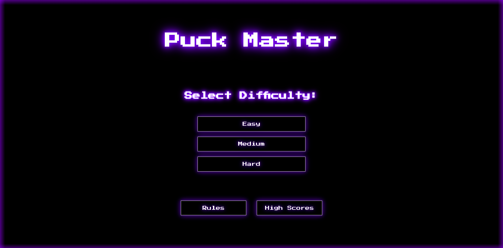

### **[Puck-Master](https://quicksum-production.up.railway.app/)**

## **Project Introduction:**

Puck-Master is an interactive and engaging virtual air hockey game built using the power of React. This application provides a delightful and addictive gameplay experience where users can compete against an AI opponent right from their browser!

The game provides three levels of difficulty - Easy, Medium, and Hard, thereby ensuring a challenge for both newbies and pros alike. Each game's objective is simple: outscore your computer-controlled opponent by controlling your paddle and hitting the puck into the opponent's goal.

In Puck-Master, I have incorporated several key features such as real-time collision detection, score tracking, and state-of-the-art game physics to deliver a realistic gameplay experience. Whether you're using a mouse or a touch device, the intuitive control mechanisms make maneuvering your paddle a breeze.

## **About The Project:**

Puck-Master is virtual table hockey game

The common functionalities are:

- The user can start the game with different difficulty modes such as easy, medium, and hard
- The user can move the player figure around by dragging with a mouse or touch on mobile devices. Desktop users can also use the "W, A, S, D" keys to move the player figure
- The player can score a goal by getting the puck into the computer's goalpost, and the computer can also score by getting the puck into the player's goalpost. When a goal is scored, the game temporarily stops and the puck is reset to the center. The score of the player who scored the goal is also increased by one
- The game checks if the player or the computer has reached a score of 15, which is the win condition. When a player wins, a message is displayed and the game can be replayed or exited
- If the puck gets stuck during gameplay, the user has the option to "unstuck" the puck, which resets the puck position back to its default position
- The user can replay the game after a win or loss. This resets the game state, including scores and positions of the player, computer, and puck

### **Built With:**

- React.js

- JavaScript (ES6+)

- HTML/CSS

### **Key Concepts:**

- AI Computer

- Interactive Game

- Responsive Web Design

- High Score Point System

- Game Modes

- Collision Detection

- Component-based Architecture

- React Hooks/Ref-based Manipulation
